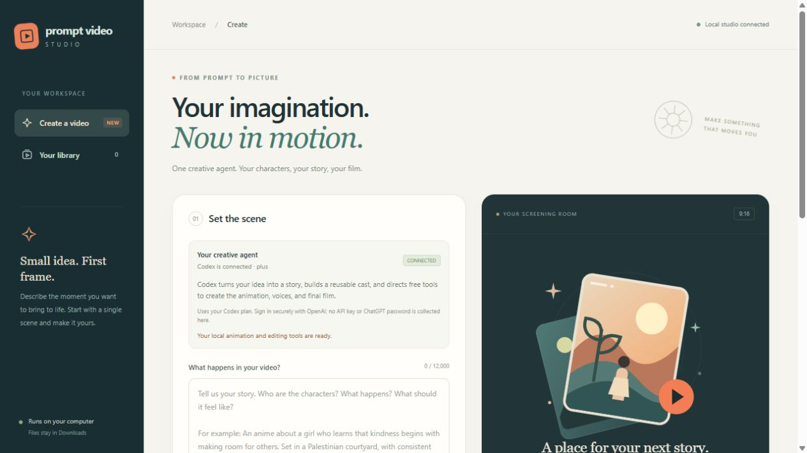

# Your first film

## Install and open

1. Get the Windows ZIP from [Releases](https://github.com/abkmystery/prompt-video-studio/releases/tag/v0.1.0).
2. Extract the whole archive to a regular folder in Downloads.
3. Double-click **Start Studio.cmd**.
4. Follow missing-prerequisite instructions. Python 3.11+ is required; setup can offer Python 3.12 through Windows Package Manager. A working official Codex installation is also required.
5. Open [127.0.0.1:8765](http://127.0.0.1:8765/) if the browser does not open automatically.

The release does not bundle Python, Codex, Blender, FFmpeg, or speech models. Setup creates a local `.venv`; the core app has no third-party Python package dependencies. **Setup.cmd** can recheck prerequisites.

## Connect and create

Use **Sign in with ChatGPT** and finish the official browser flow. An existing Codex session may already be connected. You need a supported account with available Codex usage.

Choose a 30-second draft. Describe one setting, one action, one or two characters, narration language, and sound preferences. Match the audio, duration, and aspect controls to your prompt. Try an [example](example-prompts.md), then select **Create with Codex**.

Missing tools may need downloading. Review the command, paths, and requested permissions when an action approval appears.

## Review and resume

Watch the production updates. A pause can indicate rendering, a pending approval, or an account usage limit. See [troubleshooting](troubleshooting.md).

Stop a job when needed and use its resume control to continue from saved work. Keep its output directory intact. Closing the browser does not necessarily stop the server; **Stop Studio.cmd** does.

Completed jobs provide an MP4 and production downloads. Watch the entire film and listen before publishing. Check facts, pronunciations, captions, continuity, and third-party terms.

Files remain in `outputs/<project-id>/` under the extracted app folder. The studio does not upload them.

## Try the fixed demo

**Try local demo** tests local Blender, audio, and encoding without a Codex production turn. Its predefined short scene is separate from custom productions that Codex can build.
